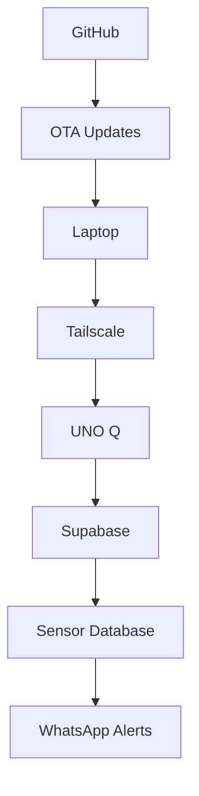
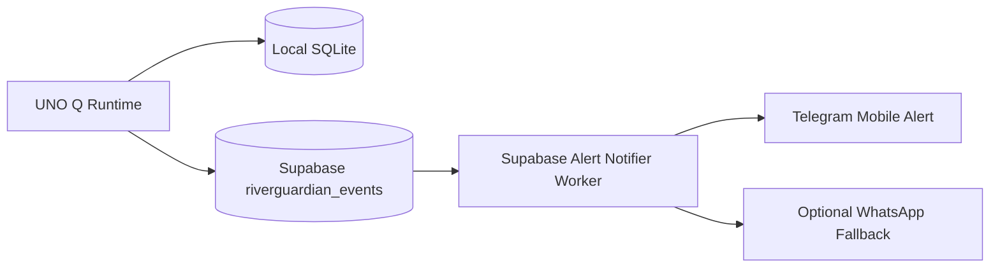

# RiverGuardianAI

Edge-first Physical AI flood-access prediction app for Arduino UNO Q.

Core concept:
- STM32 sketch handles rugged sensor/actuator duties.
- Python app on UNO Q Linux side performs edge intelligence.
- Cloud is used only for dashboard/WhatsApp communication.

This package is an App Lab-ready scaffold. Hardware-specific RS485 and 4G details must be validated on the actual UNO Q and sensor module.

## Ambient Weather Setup (Module 4)

1. Copy `config/ambient_weather_secrets.example.json` to `config/ambient_weather_secrets.json`.
2. Fill in your real Ambient credentials and station MAC address.
3. Run the weather check:

```powershell
.\.venv\Scripts\python.exe .\python\main_weather.py
```

Expected result: a JSON payload with `"station_status": "OK"` when credentials and station access are valid.

## Production Runtime (Canonical)

Run the deployment runtime from the `python` folder:

```powershell
.\.venv\Scripts\python.exe .\python\main_runtime.py
```

Notes:
- `main_runtime.py` is a launcher for `python/riverguardian_runtime.py`.
- Runtime configuration comes from `config/settings.json`.
- Optional environment overrides can be provided via `.env` (copy from `.env.example`).

### Config File Safety

- Repository includes `config/settings.example.json` only.
- Keep production `config/settings.json` local on device/host and outside Git.
- For first-time setup, copy the example to `config/settings.json` and fill values for your site.

## Controlled Deployments

- GitHub is the authoritative source.
- Deployments are tag-approved and executed manually.
- Do not auto-deploy every push to `main`.
- Use staged validation and rollback procedures documented in `docs/DEPLOYMENT.md`.

## Supabase Setup

RiverGuardian can upload cycle payloads to Supabase once credentials are configured.

1. Create a Supabase project and apply [supabase/001_riverguardian_events.sql](supabase/001_riverguardian_events.sql).
2. Put your project URL and Supabase anon key into `.env` as `SUPABASE_URL` and `SUPABASE_KEY`.
3. The migration enables insert-only writes from `anon` and `authenticated`, so the UNO Q can post directly without a separate login flow.
4. Keep `UPLOAD_MODE` unset, or set it explicitly to `SUPABASE`.
5. When both Supabase values are present, the runtime will prefer Supabase automatically.

If you want the most conservative production design, keep the device behind Tailscale and move the Supabase write into a trusted backend relay later. For a fast field deployment, the direct upload path is already ready.

Recommended field-device topology:



Why this works well:
- Tailscale handles CGNAT cleanly.
- SSH and OTA updates work over the private network.
- No port forwarding is needed.
- Supabase stays as the central cloud store for sensor events.
- WhatsApp alerts can be triggered from downstream cloud logic or your Python uploader path.

## WhatsApp Alerts (Runtime Direct)

The runtime can send WhatsApp alerts directly from `python/riverguardian_runtime.py` in a fail-safe way.

Behavior:
- Alert decision logic still comes from the existing recommendation and alert modules.
- WhatsApp send is attempted only when `alert_decision.should_send` is true.
- If provider config is missing or the API call fails, the cycle continues and sensor/risk processing is not interrupted.

Configure `.env`:

1. Enable alert delivery:
	- `WHATSAPP_ENABLED=true`
2. Pick provider:
	- `WHATSAPP_PROVIDER=TWILIO` (default)
	- or `WHATSAPP_PROVIDER=WEBHOOK`
3. For Twilio provider:
	- `TWILIO_ACCOUNT_SID=...`
	- `TWILIO_AUTH_TOKEN=...`
	- `WHATSAPP_FROM=whatsapp:+14155238886`
	- `WHATSAPP_TO=whatsapp:+91XXXXXXXXXX`
4. For webhook provider:
	- `WHATSAPP_WEBHOOK_URL=https://your-endpoint`
	- `WHATSAPP_WEBHOOK_BEARER_TOKEN=...` (optional)

Runtime output now includes:
- `whatsapp_attempted`
- `whatsapp_sent`
- `whatsapp_provider`
- `whatsapp_error`

## Free-First Mobile Alerts (Supabase Events -> Telegram)

To keep costs near zero, RiverGuardian now supports a separate notifier worker that reads alert events from Supabase and sends Telegram alerts.

Flow:



Important design points:
- Same alert logic is reused. The notifier only sends rows where `alert_should_send=true`.
- No pipeline break: if notifier fails, runtime data collection and uploads continue.
- Telegram is primary.
- WhatsApp is fallback only when enabled and Telegram send fails.

### Setup for Telegram

1. Create a Telegram bot with BotFather and copy bot token.
2. Get your chat ID (personal or group).
3. Add these in `.env`:
   - `TELEGRAM_ENABLED=true`
   - `TELEGRAM_BOT_TOKEN=...`
   - `TELEGRAM_CHAT_ID=...`
4. Keep Supabase URL/key values configured.
5. For notifier reads, set `SUPABASE_SERVICE_ROLE_KEY` on a trusted host.

### One-shot test

Run from `python` folder:

```powershell
.\.venv\Scripts\python.exe .\python\main_alert_notifier.py --once
```

If an unsent `alert_should_send=true` event exists in Supabase, the notifier sends it to Telegram and records checkpoint in `data/alert_notifier_state.json`.

### Continuous mode

```powershell
.\.venv\Scripts\python.exe .\python\main_alert_notifier.py
```

The worker polls Supabase every `ALERT_NOTIFIER_POLL_SECONDS`.

## alert_should_send Logic (Truth Table)

`alert_should_send` is computed by Alert Manager from risk state transitions and cooldown rules.

| Previous Status | Current Status | Extra Condition | alert_should_send | Alert Type |
|---|---|---|---|---|
| Any | UNKNOWN | None | true | SYSTEM_UNCERTAIN |
| None | ORANGE | First dangerous reading | true | ESCALATION |
| None | RED | First dangerous reading | true | ESCALATION |
| GREEN/YELLOW | ORANGE | Escalation to higher risk | true | ESCALATION |
| GREEN/YELLOW/ORANGE | RED | Escalation to higher risk | true | ESCALATION |
| Any lower | YELLOW | `send_yellow_alerts=true` | true | CAUTION |
| Any lower | YELLOW | `send_yellow_alerts=false` | false | NO_ALERT |
| ORANGE | ORANGE | Orange cooldown expired | true | REMINDER |
| ORANGE | ORANGE | Orange cooldown not expired | false | NO_ALERT |
| RED | RED | Red cooldown expired | true | REMINDER |
| RED | RED | Red cooldown not expired | false | NO_ALERT |
| ORANGE/RED | YELLOW | Recovery from dangerous state | true | RECOVERY |
| ORANGE/RED | GREEN | Recovery from dangerous state | true | RECOVERY |
| GREEN | GREEN | Stable safe state | false | NO_ALERT |

Notes:
- Escalation means current risk priority is higher than previous.
- Recovery currently means dangerous (`ORANGE` or `RED`) to lower (`YELLOW` or `GREEN`).
- Cooldowns are controlled by `ORANGE_COOLDOWN_S`, `RED_COOLDOWN_S`, and `YELLOW_COOLDOWN_S`.

## Supabase Edge Telegram Bot (Production Architecture)

Security rules:
- Do not run Telegram bot polling on UNO Q.
- Do not store Telegram bot token or Supabase secret/service-role keys on UNO Q.
- Store bot and secret keys only in Supabase Edge Function secrets.

Added components:
- Migration: `supabase/002_telegram_bot_platform.sql`
- Function: `supabase/functions/telegram-webhook/index.ts`
- Function: `supabase/functions/alert-dispatcher/index.ts`
- Shared modules under `supabase/functions/_shared/`

### Database objects

Migration `002_telegram_bot_platform.sql` adds:
- `telegram_subscribers`
- `notification_deliveries`
- update trigger for `updated_at`
- indexes for bot operations and alert dispatching
- restrictive RLS posture (no anon/auth read policies added)

Sensor telemetry schema now also includes production observability fields for rejected or degraded measurements:
- `raw_distance_cm`
- `accepted_distance_cm`
- `candidate_distance_cm`
- `sensor_status`
- `measurement_state`
- `sensor_error`
- `packet_sequence`
- `fw_profile`
- `fw_build`

### Secrets to configure in Supabase

Set via Supabase Dashboard (Functions Secrets) or CLI:
- `TELEGRAM_BOT_TOKEN`
- `TELEGRAM_ADMIN_CHAT_ID`
- `TELEGRAM_WEBHOOK_SECRET`
- `DASHBOARD_URL`
- `SUPABASE_SECRET_KEY` (or `SUPABASE_SERVICE_ROLE_KEY`)
- optional `ALERT_WEBHOOK_SECRET`

### Deploy functions

From repo root:

1. `supabase login`
2. `supabase link --project-ref <your_project_ref>`
3. `supabase db push`
4. `supabase functions deploy telegram-webhook`
5. `supabase functions deploy alert-dispatcher`

If your terminal cannot run interactive login prompts, use non-interactive auth:

1. Create a Supabase personal access token in your Supabase account.
2. Set environment variable `SUPABASE_ACCESS_TOKEN` in your shell.
3. Use script `scripts/deploy_supabase_edge.ps1`:

```powershell
.\scripts\deploy_supabase_edge.ps1 -ProjectRef <your_project_ref>
```

If PowerShell script policy blocks execution, run:

```powershell
powershell -ExecutionPolicy Bypass -File .\scripts\deploy_supabase_edge.ps1 -ProjectRef <your_project_ref>
```

For local function development, copy `supabase/functions/.env.local.example` to `supabase/functions/.env.local` and fill real values. This file is gitignored.

### Set Telegram webhook

Call Telegram Bot API `setWebhook` with:
- url = `https://<project_ref>.supabase.co/functions/v1/telegram-webhook`
- secret_token = your `TELEGRAM_WEBHOOK_SECRET`

### Configure database webhook for proactive alerts

Create Supabase Database Webhook:
- table: `public.riverguardian_events`
- event: `INSERT`
- URL: `https://<project_ref>.supabase.co/functions/v1/alert-dispatcher`
- headers: include `x-riverguardian-webhook-secret` when `ALERT_WEBHOOK_SECRET` is used.

### Bot commands implemented

- `/start`
- `/status`
- `/trend`
- `/alerts`
- `/health`
- `/subscribe`
- `/dashboard`
- `/help`

### Inline menu behavior

Buttons implemented:
- Current Status
- Recent Trend
- Active Alerts
- Device Health
- Alert Subscription
- Open Dashboard
- About RiverGuardian

Callback queries are acknowledged to avoid Telegram client loading state.

## Field Debug Test Plan (UNO Q + EC200U + Supabase + Telegram)

### Bench Sensor Responsiveness Mode

For close-hand lab tests where distance can rebound quickly (for example from ~60 cm back to ~200 cm), the firmware includes a profile toggle in [sketch/sketch.ino](sketch/sketch.ino):

- `#define BENCH_TEST_MODE 0` -> production-safe anti-spike filtering (default)
- `#define BENCH_TEST_MODE 1` -> bench responsiveness (accept large rebound changes quickly)

Important:
- Keep `BENCH_TEST_MODE=0` for field deployment.
- Use `BENCH_TEST_MODE=1` only during controlled bench diagnostics.

1. Device ingest test:
- Run UNO runtime for 3-5 cycles in real mode.
- Confirm local SQLite writes and Supabase inserts.

2. Bot webhook test:
- Send `/start` and `/status` from admin chat.
- Confirm response contains latest risk and freshness warning logic.

3. Auth test:
- From non-admin chat send `/status`.
- Verify unauthorized response.
- Send `/subscribe` and verify pending/limited behavior.

4. Proactive alert test:
- Insert a test row in `riverguardian_events` with `alert_should_send=true`.
- Confirm `alert-dispatcher` sends Telegram message.
- Verify `notification_deliveries` has SENT/FAILED log rows.

5. Stale-data test:
- Pause device uploads longer than `STATUS_STALE_MIN`.
- Run `/status` and verify stale warning appears.

6. LTE outage resilience test:
- Simulate temporary network loss.
- Verify runtime still processes locally and resumes cloud sync after recovery.

7. Recovery alert test:
- Create risk transition that triggers recovery.
- Confirm notification and delivery logs.
